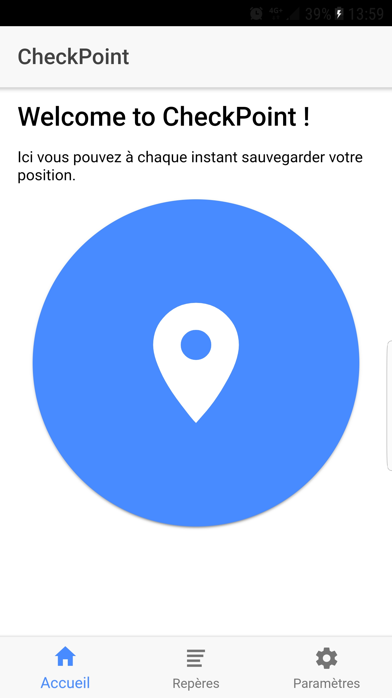
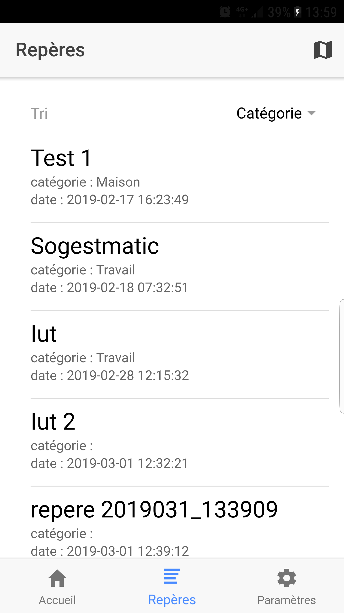
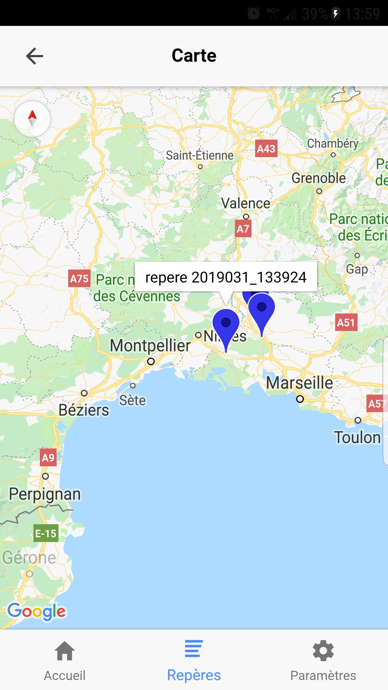
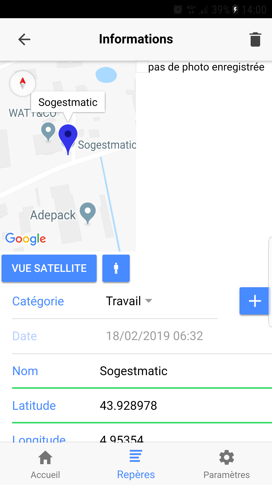
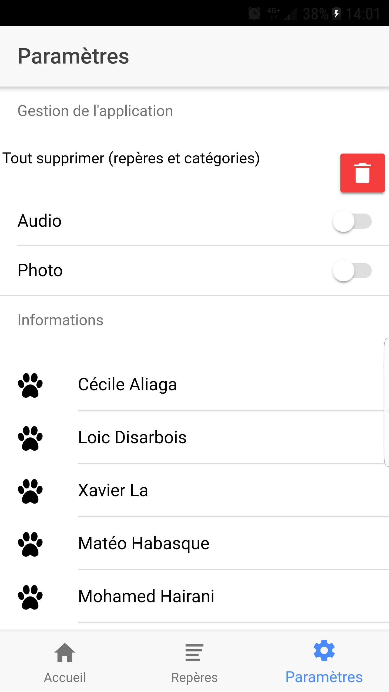

##
Lien vers la partie présentation [ici](index.md).
Lien vers la partie technique [ici](technique.md).

# Partie Fonctionnelle de l'application Checkpoint

## Fonctionnalités

Cette partie présente les différentes fonctionnalités disponible dans l'application et les méthodes associé.

### La page d'accueil

La page d'accueil contient un bouton central de grande dimension permettant à l'utilisateur de l'utiliser même lorsqu'il conduit.
Ce bouton appelle plusieurs fonctions permettant de récupérer les données nécessaire à la création d'un point d'intêret.

Les informations récupérées sont les coordonnées de la position actuelle de l'utilisateur, une note audio, une photo, la date à laquelle le point a été pris.

*Les méthodes :*

- **Constructeur** :   
Nous avons un constructeur permettant d'initialiser les variable des module utilisé pour récupérer les données. On vérifie aussi que les options de prise audio et photo sont activés ou non (voir la partie [paramètre](#la-page-parametres)).

- **ionViewDidEnter() et ionViewWillEnter()** :   
Dans ces méthodes nous vérifions juste les options de prise audio et photo.

- **click($position: string)** :   
Cette méthode permet d'effectuer le traitement de permettant de récupérer les données du point d'intérêt.
Le paramètre position permet de d'afficher le toast sur l'écran dans la position définie.

	getLatitudeLongitude :   
	Pour les coordonnées la méthode click appelle la méthode getLatitudeLongitude.
	Cette méthode retourne la position actuelle de l'utilisateur.

	startRecord et stopRecord :   
	Pour l'enregistrement de la note audio, la méthode click appelle ces deux méthode. startRecord commence l'enregistrement et stopRecord la termine.   
	La méthode startRecord retourn le chemin du fichier audio créé.

	photoshoot :   
	Pour la prise de la photo, la méthode click appelle la fonction photoshoot qui permet de prendre une photo.

	insert :   
	L'insertion des données s'effectue lors de l'appelle de cette méthode dans click.

- **sleep(miliseconds)** :   
Cette méthode permet de désactiver le bouton pendant un instant avant de pouvoir le réutiliser.
Cette instant est défini par le paramètre milliseconds.

- **getDateHeure()** :   
Cette méthodes permet de récupérer la date et l'heure courante.
Elle retourne un type string de la date et de l'heure concaténée.

- **playSound()** :   
Permet de jouer un son local à la fin des enregistrements des points d'intérêt.

### La page des repères

La page des repères permet de lister les points d'intérêt. Il est aussi possible de voir les points sur une carte globale.

*Les méthodes :*

- **Constructeur** :   
Le constructeur permet l'initialisation des les variables des modules et d'initialiser l'ordre de tri à "nom".

- **doRefresh(event)** :   
Cette méthode permet de rafraîchir cette page afin d'actualiser les points d'intérêt. Elle contient un paramètre event permet de marquer la fin de l'évènement de rafraîchissement.

- **ionViewWillEnter() et ionViewDidEnter()** :   
Permet de charger les points d'intérêt lors de l'accès à cette page.

- **selectRepere(repere)** :   
Permet de d'ouvrir la page du repère sélectionné. Le paramètre repere est utilisé pour prendre l'objet contenant les données du point d'intérêt.

- **trier()** :   
Permet de trier l'ordre d'affichage des points d'intérêt.

- **carte()** :   
Permet d'ouvrir la carte globale.

### La page carte globale

Cette page permet d'afficher la carte globale contenant tous les points lié aux points d'intérêt.

- **Constructeur** :   
Permet d'initialisé les paramètres des modules.

- **ionViewWillEnter() et ionViewDidEnter()**:   
Permet de rafraîchir les points sur la carte.

- **loadMapMultiple()** :   
Permet de charger la carte globale.

- **addMarker(listeReperes)** :   
Cette méthode permet d'ajouter les points sur la carte globale. La liste des repères et pris en paramètre.

- **deleteMarkers()** :   
Permet de supprimé les points sur la carte globale.

### La page d'information d'un repère

Cette page permet d'afficher les informations relatif au point d'intérêt.

- **Constructeur** :   
Permet d'initialisé les paramètres des modules. Les données du point d'intérêt sont récupérées et insérées dans les champs de la fiche du point d'intérêt.

- **ionViewWillEnter() et ionViewDidEnter()**:   
Permet de récupérer les catégorie de la base de données.

- **ionViewDidLoad()** :   
Permet de charger la carte au chargement de la fiche.

- **ionViewWillLeave()** :   
Permet d'arrêter l'écoute de l'enregistrement audio lorsqu'on quitte la fiche du point d'intérêt.

- **play(file)** :   
Appelle la méthode qui permet de jouer le fichier audio lié au point d'intérêt.(playAudio(file, idx))

- **stop()** :   
Permet de stopper la lecture du fichier audio.

- **enregistrer()** :   
Permet d'enregistrer les modifications du point d'intérêt.

- **insertCategorie()** :   
Permet l'insertion d'une nouvelle catégorie.

- **modifierCategorie(value)** :   
Permet de modifier une catégorie. Le paramètre value est la nouvelle valeur de la catégorie.

- **supprimer()** :   
Permet de supprimer une catégorie.

- **changementMap()** :   
Vérifie si le type de carte doit être en mapRoad ou en vue satellite.

- **loadMap()** :   
Permet de charger la carte du point d'intérêt aux coordonnées spécifié.

- **toggleStreetView()** :   
Permet d'afficher la page de la vue street view.

- **ajouterMarker()** :   
Permet de placer le marqueur sur la carte avec les coordonnées spécifiés.

- **changementTypeMap(typeMapRoad)** :    
Permet de changer le type de carte (mapRoad ou satellite). La méhode prend en paramètre un booléen. Si le booléen est vrai on change le type de carte pour mapRoad sinon il est paramétré en stree view.

- **updateLatitude() et updateLongitude()** :   
Permet de mettre à jour la latitude et la longitude des coordonnées du marqueur situé sur la carte.

- **loadTwitter()** :   
Permet d'ouvrir un navigateur qui lance une recherche Twitter de proximité avec les coordonnées gps en paramètre.

- **loadWiki()** :   
Permet d'ouvrir un navigateur qui lance une recherche Wiki de proximité avec les coordonnées gps en paramètre.

La recherche sur instagram n'a pas pu être implémenté car leur service d'api ne donne plus de token pour des accès à des données publics.

### La page paramètres

Cette page permet d'activer ou désactiver la prise de photo et d'audio et supprimer la base donnée.
- **Constructeur** :   
Permet d'initialisé les paramètres des modules. On récupère les valeurs des options de prise de photo et d'audio.

- **getOpt_audio** :   
Récupère la valeur de l'option de prise d'audio.

- **getOpt_photo** :   
Récupère la valeur de l'option de prise de photo.

- **notifyPhoto** :   
Permet de mettre à jour la valeur de l'option Photo dans la base de donnée.

- **notifyAudio** :   
Permet de mettre à jour la valeur de l'option Audio dans la base de donnée.

- **removeBase()** :   
Permet de supprimer la base de donnée.
