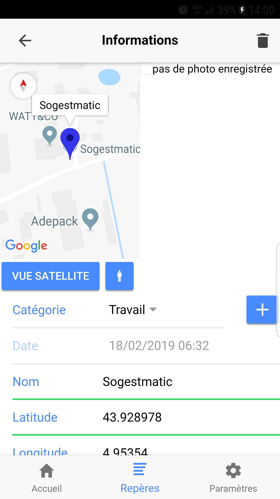

# Bienvenue sur la documentation de l'application Checkpoint

## Présentation du projet

Imaginez-vous sur l'autoroute, vous croisez un monument qui vous intrigue. Arrivé chez vous, vous avez oublié où il était. La tristitude...   
Avec notre application Checkpoint cela ne vous arrivera plus.

L’application Checkpoint va vous permettre de géolocaliser votre position et d’enregistrer un point d'intérêt. 

Ce point d'intérêt est composé :

- Des coordonnées GPS. 
- D'un mémo vocal (durée maximale 30 secondes). 
- D'une photo.
- D'une catégorie.
- D'un nom.
- D'une date/heure.
- D'une description.

## Comment installer l'application sur un poste

*Prérequis :*
Pour installer l'application il faut tout d'abord installer [node.js](https://nodejs.org/fr/) et le [framework ionic](https://ionicframework.com/docs).

*Commandes :*

* `npm install` - Permet d'installer tous les modules utilisé par l'application
* `ionic cordova build android` - Permet de générer l'apk qui se trouves dans [racine du projet]/platform/android/build/outputs/apk/

## Systèmes d'exploitations compatibles

L'application a été développer uniquement pour android.

Pour un portage iOS il est necessaire de posséder :	

- Un Mac OSX - necessaire à la compilation du projet des application iOS.
- XCode - compilateur Mac qui génère des programmes qui fonctionnentsur le système iOS.
- GoogleMaps - Générer une clé d'API spécifique pour iOS. Cliquer [ici](https://developers.google.com/maps/documentation/ios-sdk/intro) pour plus d'informations.
- Audio - Ajouter le format audio compatible avec iOS.