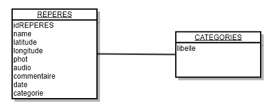

Lien vers la partie présentation [ici](index.md).   
Lien vers la partie fonctionnelle [ici](technique.md).
##
# Partie technique de l'application Checkpoint

## Modules

Ces modules sont présent dans le fichier package.json.   
On ne détaillera pas tous les modules utilisés. Seulement ceux en lien avec les fonctions principales de l'application.

* `Camera` - Permet la gestion de photos. [Info](https://ionicframework.com/docs/native/camera)
* `Geolocation` - Permet la gestion de la géolocalisation. [Info](https://ionicframework.com/docs/native/geolocation)
* `GoogleMaps` - Permet d'afficher une carte Google Maps. [Info](https://github.com/ionic-team/ionic-native-google-maps)
* `Insomnia` - Permet de désactiver la mise en veille du téléphone. [Info](https://ionicframework.com/docs/native/insomnia)
* `Media` - Permet d'enregistrer et d'écouter un enregistrement audio. [Info](https://ionicframework.com/docs/native/media)
* `SQLite` - Permet la gestion de la base de données de l'application. [Info](https://ionicframework.com/docs/native/sqlite) 

## La base de données

## Contraintes techniques

L'application a été développé avec le framework [Ionic](https://ionicframework.com/).

Ionic permet de créer une application hybride.  C'est un site Web(HTML/CSS/JavaScript) affiché dans une WebView(navigateur nu résent sur chaque système d'exploitation smartphone) qui permet d'accéder aux fonctionnalités native des smartphones.

